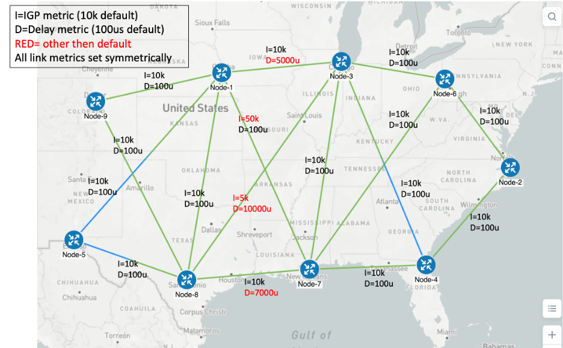

# Cisco Transport Slicing- Setup and Sample Payloads for Various Slicing Use-cases 

This is a repo of sample payloads and usage for deploying Cisco's Transport Slicing Solution with Cisco's Network COntroller (CNC) which includes Cisco's Network Services Orchestrator (NSO).
The Slicing YANG model is based off of an early version of the IETF work specified here: 
https://datatracker.ietf.org/doc/html/draft-ietf-teas-ietf-network-slice-nbi-yang-03

Longer term and once the IETF YANG model goes to WGLC and is standardized, it will be updated to the latest version for compatibility. Cisco has augmented the model to support additional optional parameters. 

## Network Prerequisites

The Network devices used in our experimentation were Cisco NCS5500s and vXR9K Routers. Configurations are available in the RouterConfigs folder in various formats.
The network is running SR-MPLS, MP-BGP, ISIS and has both PCE and RR components.  

It is also assumed if using the input and output QoS options in the Slicing Catalog that the appropriate QoS policy maps have been pre-positioned on the devices.

## NSO Prerequisites

It is assumed you have a working NSO 6.1 System with the latest T-SDN CFP loaded. Additionally, you optionally can have a CNC5.0 system installed which 
includes NSO 6.1 and the required T-SDN CFPs.


## Verifying the NSO T-SDN and Slicing packages

Please follow all Release Notes to install and load bootstab files.

```

admin@ncs# show packages package oper-status up      
NAME                          UP  
----------------------------------
cisco-L2vpn-fp-internal       X   
cisco-L3vpn-fp-internal       X   
cisco-aa-service-assurance    X   
cisco-cfp-jwt-auth            X   
cisco-cs-sr-te-cfp            X   
cisco-ios-cli-6.86            X   
cisco-iosxr-cli-7.46          X   
cisco-iosxr-cli-7.52          X   
cisco-iosxr-nc-7.5            X   
cisco-pm-fp                   X   
cisco-pm-fp-internal          X   
cisco-rsvp-te-fp              X   
cisco-sr-te-cfp               X   
cisco-sr-te-cfp-internal      X   
cisco-tm-tc-fp                X   
cisco-tsdn-core-fp-common     X   
core-fp-common                X   
core-fp-delete-tag-service    X   
core-fp-plan-notif-generator  X   
custom-template-utils         X   
cw-device-auth                X   
dlm-svc                       X   
ietf-l2vpn-nm                 X   
ietf-l3vpn-nm                 X   
ietf-network-slice-service    X   
ietf-te-fp                    X   
l2vpn-multi-vendors           X   
l3vpn-multi-vendors           X   
lsa-utils                     X   
pm-multi-vendors              X   
resource-manager              X   
rest-api-explorer             X   
rsvp-te-multi-vendors         X   
sr-te-multi-vendors           X   
tm-tc-multi-vendors           X   

```

### One-time configurations to set-up the NSO Slicing system:

In the payloads folder, load the pre-slice instantiation files listed in order (starting with 0aa to 0f).
These files can also be customized to satisfied your systems's requirements

```
These files accomplish the following:
0aa_custom_templates.cli- load custom templates for complex use cases
0a_odn_policies.cli- pre-load ODN templates into the SR-TE CFP.
0b_resource_pools.cli- pre-loaded all resource pools required for coloring, evi's, L2 and L3 RTs, Y1731, etc
0c_l2vpn_pool.cli- pre-load additional l2vpn-ntw pools
0d_pm-profiles.cli- pre-load performance management pools for SR-PM
0e_y1731.cli- pre-load Y1731-profile configs
0f_slicing-pre-configs.cli- pre-load Slicing template catalog
```

#### Sample Payloads with use-cases

The following test use-case payload are available. Several of these use-cases will require additional prerequisites which are called out in separate read me files.

```
Slice Test-Cases (test letters maps to payload name): Be aware some payloads may use the same endpoints, so proper cleanup is required before
creating a new slice.

a- Three site any-to_any L3 Slice with various catalog entries, eMBB, URLLC, Gold (Gold=no SR-TE but high priority QoS)

b- Switch from eMBB to URLLC

c- L2 P2P 

d- Three site a2a L2 Multi-Point 

e- One shared slice L3 site with eMBB (NAPA) and one any-to_any L3 dedicated URLLC Slice (FORD) with two sites with Single-sided-control and another payload without without SSC.

f- One shared slice L3 site with eMBB (NAPA) and two dedicated slices, each with one site any-to-any L3. Ford with URLLC with Single-sided-control and Chevy with eMBB

g- One shared slice L2 (any to any) site with eMBB (NAPA) and two dedicated slices, each with one site any-to-any L2. Ford with URLLC with Single-sided-control and Chevy with eMBB (same test case as f but for L2).

h- Three site hub-spoke L3 slice with URLLC (two spokes can not communicate with each other). Also a test error payload with hub and spoke site on same PE 

i- Three site hub-spoke L2 slice with URLLC (two spokes can not communicate with each other).

j- One shared slice L3 site with eMBB (NAPA) and one dedicated hub-spoke slice (1) one with no hub specified, just spokes (2) another payload with both a shared slice and a hub specified on same PE as shared site.  Both are Ford spokes with URLLC with Single-sided-control


k- One shared slice L2 (any to any) site with eMBB (NAPA) and two dedicated slices, each are hub-spoke L2, with each only having a spoke defined. Ford with URLLC with Single-sided-control and Chevy with eMBB  

l- Same as a, h, i but using manaul RT assignment, along with adding extra RTs for SDP 1.

m- Same as #a, but using manaul RD assignment (and mix with auto SDPs)

n- Mix of BWOD Use cases, using new BWOD catalog entries. (1)  with BWOD custom entry, (2) with BWOD 1G entry (pre-defined in sr-te template). (enable BWOD COE feature in CNC)

o- Same as a, but with Encrypted Slice type using Flex-Algo 129 with link affinities.

p- same as a, but using catalog entry that specifes SR-PM for both delay (URLLC) and liveness (eMBB))

q- Testing for DSCP per-flow based slices. Need to view README as this is technically not supported slice type but we can make work. load pre-requisit configs (custom-template and ODN policy) to allow for non supported CFP commands. 

r- same as a, but using Disjoint Path slice type via flex-algo 131 or 132 for a North bound path or a South bound path

s- Same as a, but workaround to support  "cumulative bound metrics" or bounded slice delays. Need to view README and manaully configure proper custom-templates and ODN templates to allow for unsupported CFP commands. 

t- rework of CNC example from docuementaiton but using slicing services. Intent includes disjoint paths for traffic sent from Node-5 to either Node-4 or Node-2 (only one direction) and low latency. Two solutions identiied, one using disjoint path command in ODN template and the other using disjoint FA policy.


```




